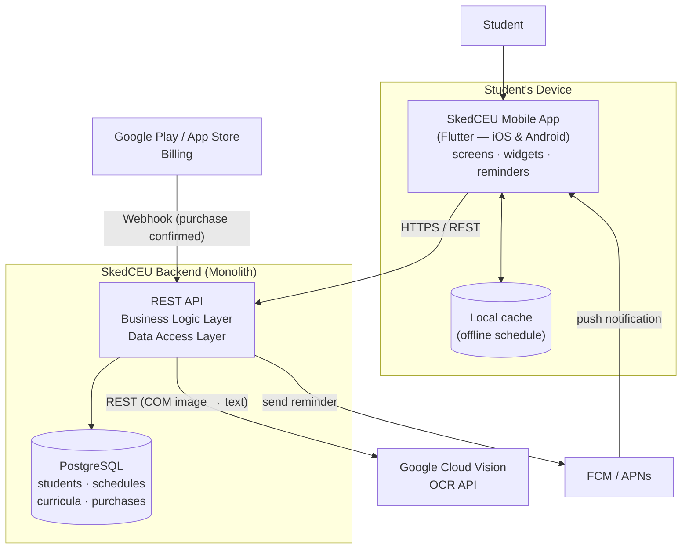

# SkedCEU

> Scan your COM once. Get your schedule everywhere.

A mobile application (iOS and Android) for Centro Escolar University students that converts a photo of the Certificate of Matriculation (COM) into a live class schedule — complete with home screen widgets, lock screen reminders, and a curriculum map that shows subject prerequisites.

---

## System Overview

Every new semester, CEU students receive a Certificate of Matriculation listing their enrolled subjects, section, rooms, and class times. Most students simply take a photo of it and dig through their phone gallery whenever they need to check what room they are in. SkedCEU replaces that habit: the student scans or uploads the COM once, the app extracts the schedule automatically using OCR, the student reviews and confirms the extracted data, and from then on the schedule is available in the app, on home screen widgets, and through lock screen notifications before each class.

The app also includes a curriculum tab. Since program curricula are accessible to students, SkedCEU stores them per program so that tapping any subject shows its prerequisite chain — helping students understand why they are taking a subject and what it unlocks.

SkedCEU is free to download and use. A one-time payment unlocks premium personalization features (additional widget styles and custom backgrounds/themes).

## Problem Being Solved

- Students repeatedly open a static photo of their COM just to check their section, room, or schedule.
- A photo cannot remind you that your next class starts in 30 minutes in Room 402.
- The COM does not explain the curriculum — students cannot easily see which subjects are prerequisites of which.
- Every new semester the cycle repeats: new COM, new photo, same friction.

## Target Users

| User | Role |
|---|---|
| CEU Manila students | Primary users — scan their COM, view schedules, receive reminders, browse their curriculum |
| App administrator (developer) | Secondary — maintains curriculum and prerequisite data per program |

## Main Features

1. **COM scan and auto-extraction** — take a photo or upload the COM; OCR extracts enrolled subjects, section, rooms, and class times.
2. **Review-and-confirm screen** — the extracted schedule is shown for correction before saving; manual entry is available as a fallback if OCR fails.
3. **Schedule view and widgets** — in-app timetable plus home screen and lock screen widgets.
4. **Class reminders** — push notifications before each class, including the room number.
5. **Curriculum and prerequisites tab** — browse the program curriculum; tapping a subject shows its prerequisites.
6. **Premium unlock (one-time payment)** — additional widget styles and custom themes. The core scheduling features remain free.

## Project Structure

```
skedceu/
│
├── src/
│   ├── mobile/        # Flutter mobile app (iOS + Android)
│   └── backend/       # REST API server
├── tests/
├── docs/
├── assets/
├── config/
├── README.md
└── .gitignore
```

| Folder/File | Purpose |
|---|---|
| `src/mobile/` | Source code of the Flutter mobile application (single codebase for iOS and Android) |
| `src/backend/` | Source code of the REST API backend (accounts, schedules, curriculum data, purchase records) |
| `tests/` | Unit, integration, and end-to-end test files |
| `docs/` | Documentation, architecture diagram, and the lab reflection |
| `assets/` | Images and supporting files (mockups, redacted sample COM) |
| `config/` | Configuration files (environment templates, build configs) |
| `README.md` | Information about the project (this file) |
| `.gitignore` | Files that should not be tracked by Git (secrets, build outputs, dependencies) |

**Deviation from the default structure:** `src/` is split into `mobile/` and `backend/` because SkedCEU has two codebases — the Flutter client and the API server — that are developed and deployed differently but belong to one system.

## MVC Design

### Model

The data the system needs to represent:

| Model | Description |
|---|---|
| `Student` | Account information (name, email, program, hashed password) |
| `COMDocument` | An uploaded COM image and its processing status (deleted after successful parsing) |
| `Subject` | A subject in a curriculum (code, title, units) |
| `ScheduleEntry` | One enrolled class: subject + section + room + day + time |
| `Curriculum` | The set of subjects for a program per year level |
| `Prerequisite` | A link stating that one subject requires another |
| `Purchase` | A record of the one-time premium unlock |

### View

What the user sees and interacts with:

- Onboarding / COM scan screen
- OCR review-and-confirm screen (editable extracted schedule)
- Schedule screen (timetable)
- Home screen and lock screen widgets
- Curriculum screen with prerequisite view
- Premium / unlock screen
- Settings screen

### Controller

The actions the system handles:

| Controller | Responsibility |
|---|---|
| `UploadCOMController` | Receives the COM image and forwards it to the OCR service |
| `ParseScheduleController` | Converts raw OCR text into structured `ScheduleEntry` records |
| `ScheduleController` | Create, read, update, and archive schedules per semester |
| `NotificationController` | Schedules class reminders and sends them through push services |
| `CurriculumController` | Serves curriculum and prerequisite data per program |
| `PurchaseController` | Verifies premium purchases and unlocks features |

**Why these choices:** each controller maps to exactly one user-visible action group, and each model maps to one real-world thing on the COM or in the curriculum. The review-and-confirm flow is deliberately its own step between `UploadCOMController` and `ScheduleController` so that OCR mistakes never silently corrupt a saved schedule.

## Layered Architecture

```
Presentation Layer   →  Flutter screens, widgets, notifications
        ↓
Business Logic Layer →  Parsing, validation, entitlements, reminders
        ↓
Data Access Layer    →  Repositories (API + local cache)
        ↓
Database             →  PostgreSQL
```

### Presentation Layer

The Flutter app: scan screen, review-and-confirm screen, timetable, curriculum browser, premium screen, plus the home/lock screen widgets and notification banners rendered by the OS.

### Business Logic Layer

- Parse OCR output into structured schedule entries (subject code matching, time/room extraction).
- Validate schedules (detect impossible overlaps, unknown subject codes).
- Resolve prerequisite chains for the curriculum view.
- Check premium entitlement before enabling premium features.
- Compute when each class reminder should fire.

### Data Access Layer

Repository classes that abstract where data comes from:

- **Remote:** REST calls to the backend API for accounts, schedules, curricula, and purchase verification.
- **Local:** on-device storage that caches the confirmed schedule, so the app and widgets keep working without an internet connection.

### Database

PostgreSQL on the backend storing: `students`, `schedules`, `schedule_entries`, `subjects`, `curricula`, `prerequisites`, and `purchases`. COM images are only held temporarily during parsing and are deleted after the student confirms the schedule.

## Integration Pattern

SkedCEU uses the patterns that its features actually require — and deliberately skips the ones they don't.

### 1. API / REST — OCR service (chosen)

```
SkedCEU Backend  →  Google Cloud Vision API (OCR)
```

**Why:** COM parsing is a direct request/response interaction — the app uploads an image and needs the extracted text immediately so the student can review it. A synchronous REST call is the natural fit. Building our own OCR would be far harder and less accurate than using a proven vision API.

### 2. Webhook — payment confirmation (chosen)

```
Google Play / App Store  →  Webhook  →  SkedCEU Backend
```

**Why:** the one-time premium purchase is processed by the platform stores. The store notifies our backend *after* the purchase (or a refund) happens — a classic webhook scenario, because the event originates on the external service's side and we should not poll for it.

### 3. Push notification services (FCM / APNs)

```
SkedCEU Backend  →  FCM / APNs  →  Student's device
```

**Why:** lock screen class reminders can only be delivered through the platform push services.

### Patterns not used, and why

- **Message queue / event broker:** there is no high-volume asynchronous work between internal services — the backend is one application. A broker would add infrastructure with nothing to decouple.
- **Database sharing:** no second application needs our database; sharing it would only create tight coupling and a security risk.

## Architectural Style

**Chosen style: Monolithic backend with a mobile client.**

The backend is a single deployable REST API in front of a single database; the Flutter app is the client.

**Why this is appropriate:**

- The system is built by a very small team (one student developer). One codebase, one deployment, and one database are dramatically simpler to develop, debug, and operate.
- The features (schedules, curriculum, purchases) are tightly related and share the same data — splitting them into microservices would create network boundaries where none are needed.
- Expected scale (students of one university) is well within what a single well-built API instance can serve; the heaviest operation (OCR) is already offloaded to an external service.
- If the app later grows (e.g., to multiple universities), the layered internal structure makes it possible to extract a service *then* — paying the microservices cost only when it buys something.

## SIA Design Considerations

### Scalability

The realistic traffic spike is **enrollment week**, when most students scan their COM within a few days. The API is stateless, so it can run as multiple identical instances behind a load balancer. The most expensive operation — OCR — is delegated to Google Cloud Vision, which scales independently of us. Day-to-day schedule viewing hits the on-device cache, not the server.

### Resilience

- If the OCR service is down or misreads the COM, the **review-and-confirm screen** and **manual entry** keep the core flow working — OCR failure degrades convenience, not functionality.
- If the backend is unreachable, the confirmed schedule and widgets keep working from the **local cache**.
- If a payment webhook is missed, the app can re-verify the purchase with the store on next launch.

### Maintainability

The layered structure plus repository pattern means new features slot in without rewrites: a future feature (e.g., a grade tracker) is a new controller, model, and screen. Supporting a new program's curriculum is a **data change, not a code change** — new rows in `curricula` and `prerequisites`.

### Security

The COM contains real personal information: full name, student number, program, and section.

- All traffic uses HTTPS.
- COM images are deleted after parsing; only the structured schedule is stored.
- Passwords are stored hashed (bcrypt); sessions use short-lived tokens.
- Payments are handled entirely by the platform stores — no card data ever touches the SkedCEU backend.
- Curriculum data is public information; personal schedules are only readable by their owner.

### Observability

- Structured logging on the backend (every request, every OCR job, every webhook received).
- Crash reporting in the mobile app (e.g., Firebase Crashlytics).
- A tracked **OCR success-rate metric** — the single most important health signal: if the parser's accuracy drops (e.g., the COM format changes), developers see it immediately instead of hearing it from frustrated students.

## Architecture Diagram

The editable diagram is in [`docs/architecture.drawio`](docs/architecture.drawio) (open with [diagrams.net](https://app.diagrams.net)).



**Reading the diagram:** the student interacts only with the mobile app. The app talks to the monolithic backend over HTTPS. The backend calls the OCR API when a COM is uploaded, receives webhooks from the platform billing services when a premium purchase completes, and triggers class reminders through FCM/APNs. The local cache keeps schedules and widgets working offline.
